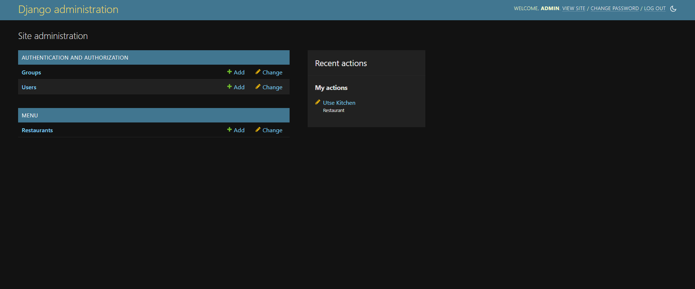
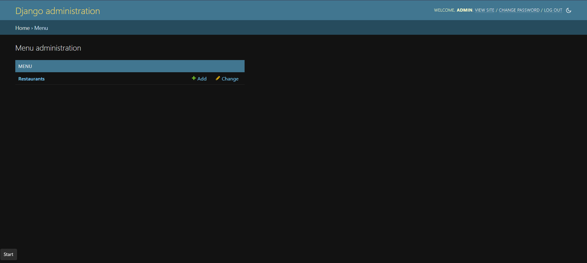
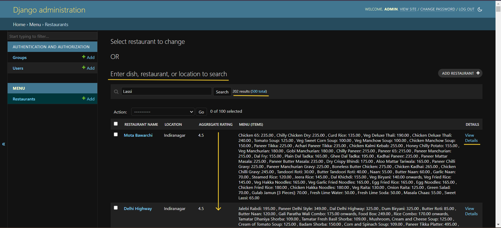
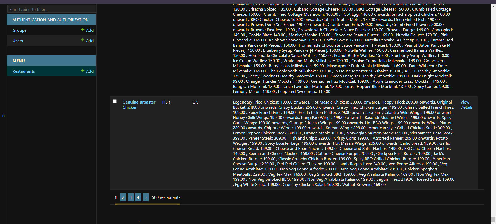
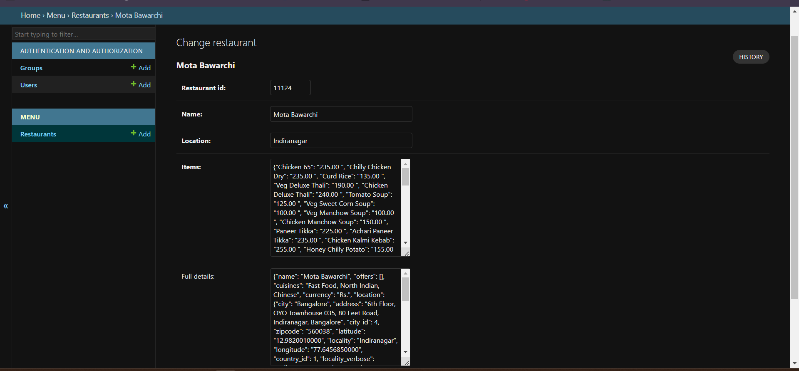
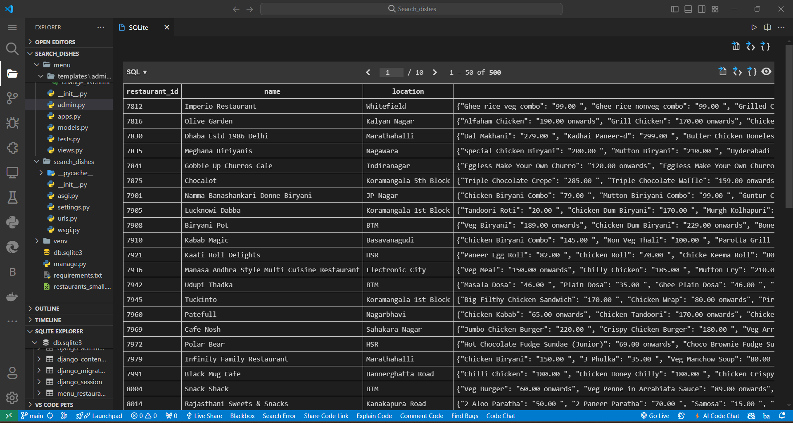

# Restaurant_Search

- This project is a Django-based web application that enables users to search for restaurants by dish names, restaurant names, or locations.
- The application includes a custom admin interface with enhanced search functionality.
- The search results display restaurants offering the searched dishes, sorted by their aggregate ratings.

## Features

 **🔍 Advanced Search :**
 Search for dishes, restaurant names, or locations.

**🛠️ Custom Admin Interface :**
Enhanced admin panel with powerful search and sorting capabilities.

**📂 CSV Data Import :**
 Easily load restaurant data from a CSV file into the Django model.

**🍽️ Detailed Restaurant Information :**
 View detailed information about each restaurant, including menu items and ratings.

## Screenshots

